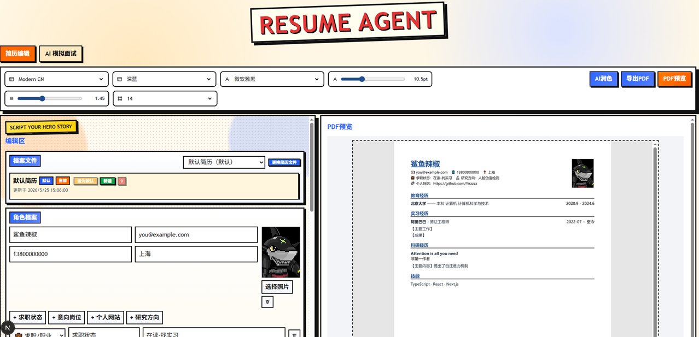
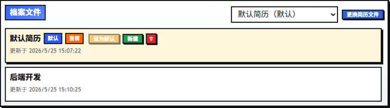
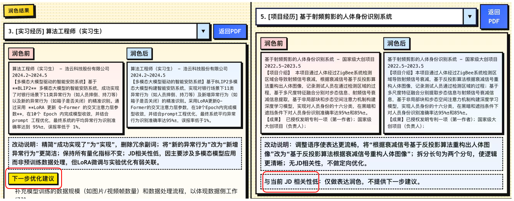
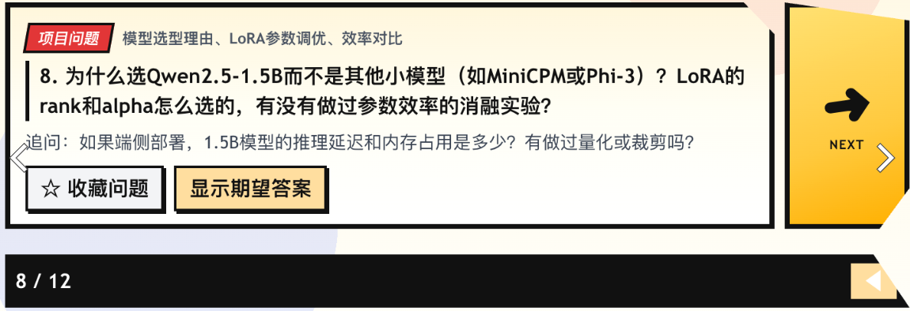

# 🚀 Resume Agent

一个低门槛的 Web 简历 Agent 平台：支持面向JD的AI润色、AI面试；多简历文件管理、结构化编辑、实时 PDF 预览与导出。




## ✨ 基础功能

- 🧩 模块化编辑：工作/项目/科研/教育等模块可增删、排序、自定义
- 🗂️ 多简历文件：新建、切换、设默认、删除、共享角色档案



- 🎨 样式配置：字体、字号、行高、页边距、主题色可保存
- 🖼️ 头像与信息：角色档案支持头像、附加信息与图标展示
- 📄 导出稳定：基于 Playwright 的 A4 PDF 导出


## 💡 高级功能 （需配置LLM）

* AI润色 （根据 JD 对目标项目进行润色，若与JD相关会提出进一步的优化）



* AI 面试 (根据JD进行模拟面试)




## 🚀 快速开始

### 1) 环境准备

- Node.js 20+
- pnpm 10+

### 2) 安装依赖

```bash
pnpm install
```

### 2.1) 安装 Playwright Chromium（PDF 预览必需）

```bash
pnpm --filter api exec playwright install chromium
```

### 3) 初始化本地数据

```bash
cp data/resume-files.example.json data/resume-files.json
```

### 4) 快速启动前后端

```bash
pnpm dev
```

默认访问：

- 🌐 Web: `http://localhost:3000`
- 🔌 API: `http://localhost:3001`（若端口占用会自动顺延）

### 5) 模型配置

```bash
Copy-Item .\.env.example .\.env
```

> INTERVIEW_BASE_URL=your_baseurl
> INTERVIEW_API_KEY=your_api_key_here
> INTERVIEW_MODEL=your_model


## 🔗 友链链接

非常感谢linux do社区提供的交流平台：https://linux.do/latest

