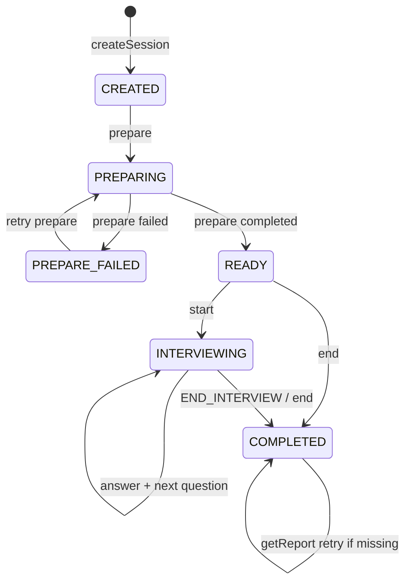
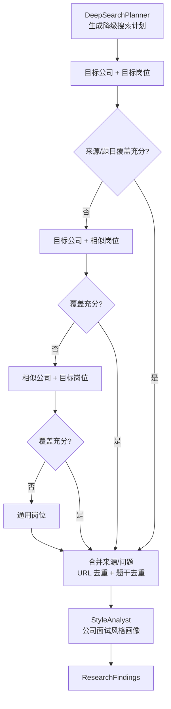
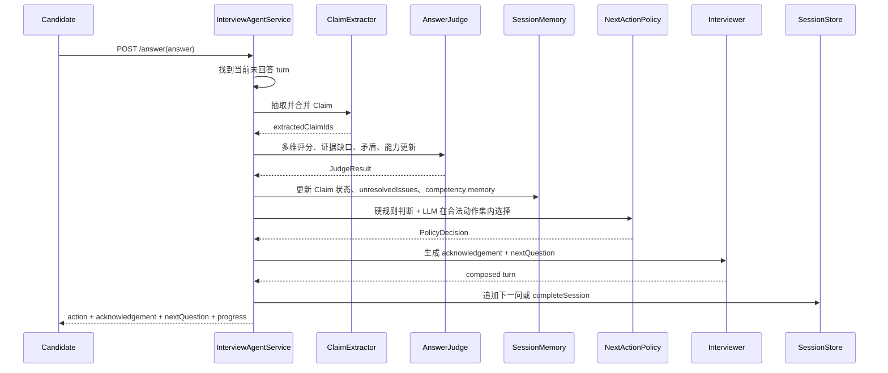
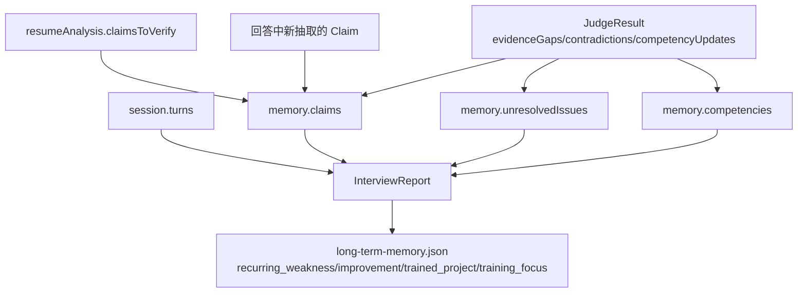
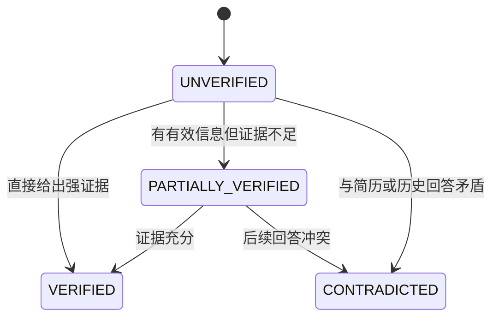
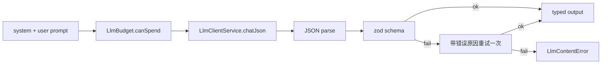

# Deep Interview Agent Flow

本文描述当前 Deep Interview Agent 的数据流和控制流。代码主入口在 `apps/api/src/interview-agent/`，前端入口是 `apps/web/src/components/deep-interview.tsx`。

## 目标

Deep Interview Agent 不是一次性生成题单，而是一个带准备期、会话状态、短期记忆、长期记忆和可追溯报告的面试编排器。它的核心目标是：

- 根据 JD、岗位、简历项目和可选的面经检索结果生成面试计划。
- 在对话中动态追问，而不是固定按题单播放。
- 把候选人的回答转成可追踪的 Claim、能力评分、证据缺口和矛盾点。
- 面试结束后生成结构化报告，并沉淀跨 session 的长期训练记忆。

## 外部接口

后端控制器：`apps/api/src/interview-agent/interview-agent.controller.ts`

| API | 作用 | 主要状态要求 |
| --- | --- | --- |
| `POST /api/interview-agent/sessions` | 创建深度面试 session，保存脱敏简历快照 | 需要 LLM provider |
| `POST /api/interview-agent/sessions/:id/prepare` | 准备期：JD 分析、简历分析、研究、计划生成 | `CREATED` 或 `PREPARE_FAILED` |
| `POST /api/interview-agent/sessions/:id/start` | 开始面试并发出第一题 | `READY` |
| `POST /api/interview-agent/sessions/:id/answer` | 提交候选人回答，触发动态追问决策 | `INTERVIEWING` |
| `POST /api/interview-agent/sessions/:id/end` | 主动结束并生成报告 | `READY` / `INTERVIEWING` / `COMPLETED` |
| `GET /api/interview-agent/sessions/:id/report` | 获取或补生成报告 | `COMPLETED` |
| `GET /api/interview-agent/memory?resumeFileId=` | 查看某份简历的长期记忆 | 无会话状态要求 |
| `DELETE /api/interview-agent/memory/:entryId` | 删除长期记忆条目 | 无会话状态要求 |

## 总览流程

```mermaid
flowchart TD
  UI["Web 深度面试界面"] --> Create["POST /sessions"]
  Create --> StoreCreated["SessionStore: CREATED\n保存 input + 脱敏 resumeSnapshot"]
  StoreCreated --> Prepare["POST /sessions/:id/prepare"]

  Prepare --> JD["JdAnalyzer\nJD -> jdMatrix"]
  JD --> Resume["ResumeAnalyzer\nresumeSnapshot + jdMatrix -> resumeAnalysis"]
  Resume --> Seed["SessionMemory\nclaimsToVerify -> memory.claims"]
  Seed --> Research["ExperienceResearcher\n多层搜索 + 风格画像 -> research"]
  Research --> Planner["InterviewPlanner\n生成 mainQuestionPool"]
  Planner --> Review["PlanReviewer\n质检与最终补齐"]
  Review --> Ready["SessionStore: READY\n保存 plan + trace + usage"]

  Ready --> Start["POST /sessions/:id/start"]
  Start --> FirstQ["Interviewer\n选择第一道主问题 + opening"]
  FirstQ --> Interviewing["SessionStore: INTERVIEWING\n追加第 1 个 turn"]

  Interviewing --> Answer["POST /sessions/:id/answer"]
  Answer --> Claim["ClaimExtractor\n回答 -> 新 Claim"]
  Claim --> Judge["AnswerJudge\n评分 + 证据缺口 + 矛盾"]
  Judge --> Memory["SessionMemory\n更新 Claim/Issue/Competency Memory"]
  Memory --> Policy["NextActionPolicy\n硬规则 + LLM 合法动作选择"]
  Policy --> Compose["Interviewer\n生成回应和下一问"]
  Compose --> Next{"继续?"}
  Next -->|追加下一问| Interviewing
  Next -->|结束| Complete["completeSession"]

  Complete --> Report["ReportGenerator\n结构化复盘报告"]
  Report --> LTM["LongTermMemory\n跨 session 训练记忆"]
  LTM --> Completed["SessionStore: COMPLETED"]
```

## Session 状态机

`runExclusive(sessionId, fn)` 给同一个 session 加串行锁，避免 prepare/answer 并发写同一份 session 文件。LLM 内容失败会转成 503，对话轮次失败时尽量不污染已保存状态。

## 准备期数据流

准备期由 `InterviewAgentService.prepareInner()` 编排，每个阶段完成后立即 `store.save(session)`，所以失败时可以从上一次可用状态重试。

```mermaid
flowchart LR
  Input["SessionInput\nresumeFileId/company/position/JD/round/mode/maxQuestions"] --> Snapshot["SanitizedResume\n移除姓名/电话/邮箱/照片"]
  Snapshot --> JD["JdAnalyzer"]
  JD --> Matrix["jdMatrix\ncompetencies/category/importance/questionRatio/evidenceKeywords"]

  Matrix --> Resume["ResumeAnalyzer"]
  Snapshot --> Resume
  Resume --> Analysis["resumeAnalysis\nprojects/attackSurface/claimsToVerify"]
  Analysis --> SeedClaims["memory.claims\nUNVERIFIED"]

  Matrix --> Research["ExperienceResearcher"]
  Analysis --> Research
  Research --> Search["InterviewSearchService\n可选 Tavily/Jina/LLM 抽题"]
  Search --> Findings["research\nsources/extractedQuestions/styleProfile/searchRounds/degraded"]

  Matrix --> Plan["InterviewPlanner"]
  Analysis --> Plan
  Findings --> Plan
  Plan --> Pool["plan.mainQuestionPool\nobjective/rubric/targetClaims/styleEvidence"]
  Pool --> Review["PlanReviewer\n唯一性/题量/项目锚点/stopConditions"]
  Review --> Ready["status=READY"]
```

### 1. 创建 session

`createSession()` 做三件事：

- 检查 LLM provider 是否存在。Deep Interview 不在无模型时伪造模板内容。
- 读取 `resumeFileId` 对应的简历文件。
- 调用 `sanitizeResume()` 生成 `resumeSnapshot`：去掉姓名、邮箱、电话、头像，只保留概要和有限的公开型 extra info。

落盘位置：`data/interview-agent/sessions/<sessionId>.json`

### 2. JD 能力矩阵

模块：`JdAnalyzerService`

输入：

- `company`
- `position`
- `jobDescription`
- `JdParserService` 提取的关键词

输出写入 `session.jdMatrix`：

- `competencies`
- `category`
- `importance`
- `questionRatio`
- `evidenceKeywords`

用途：后续简历分析、题目规划、能力覆盖率计算和报告画像。

### 3. 简历深度分析

模块：`ResumeAnalyzerService`

输入：

- `resumeSnapshot`
- `jdMatrix.competencies`

输出写入 `session.resumeAnalysis`：

- `projects`：可面试项目锚点。
- `attackSurface`：缺 baseline、职责不清、指标口径不明等攻击面。
- `claimsToVerify`：面试中必须验证的具体断言。

随后 `SessionMemoryService.seedResumeClaims()` 把 `claimsToVerify` 种入 `session.memory.claims`，初始状态是 `UNVERIFIED`。

### 4. 面经研究与公司风格画像

模块：`ExperienceResearcherService`

它是一个受代码控制的 ReAct 研究循环：

约束：

- 最大搜索轮数：`INTERVIEW_AGENT_MAX_SEARCH_ROUNDS`
- 最大页面数：`INTERVIEW_AGENT_MAX_PAGES`
- 充分覆盖阈值：`INTERVIEW_AGENT_MIN_SOURCES` 和 `INTERVIEW_AGENT_MIN_QUESTIONS`

`TAVILY_API_KEY` 是增强项，不是硬依赖。无 Tavily 时，研究链路会降级，`research.degraded=true`，后续规划仍会继续。

### 5. 面试计划生成与质检

模块：

- `InterviewPlannerService`
- `PlanReviewerService`

输入：

- `jdMatrix`
- `resumeAnalysis`
- `research`

输出写入 `session.plan`：

- `competencyPriorities`
- `focusProjects`
- `highRiskClaims`
- `mainQuestionPool`
- `difficultyDistribution`
- `stopConditions`

关键防线：

- schema 校验：确保 LLM 输出是合法 JSON。
- nullable 兼容：`targetProjectId: null` 会被规范化为缺省，数组字段的 `null` 会规范化为空数组。
- sanitize：引用 id 必须真实存在，否则过滤或置空。
- reviewer：检查题池数量、重复题、是否有足够项目锚点，不合格会要求 LLM 重写，最终仍不足则失败。

## 对话期数据流

`answer()` 每轮大致是 3-4 次 LLM 调用，受 `LlmBudget` 限制。代码注释中的 turn 管道是当前事实来源：

### start

`start()` 只在 `READY` 状态可用：

- `InterviewerService.chooseNextMainQuestion()` 从 `plan.mainQuestionPool` 选第一题。
- `appendQuestionTurn()` 写入第一个 `InterviewTurn`。
- `InterviewerService.opening()` 生成开场白。
- session 状态变成 `INTERVIEWING`。

### answer

每轮输入是候选人的自然语言回答。当前未回答的 `turn` 会被补充：

- `answerText`
- `answeredAt`
- `extractedClaimIds`
- `judge`
- `decision`

然后根据策略决定下一步：

| action | 含义 | 后续 |
| --- | --- | --- |
| `FOLLOW_UP` | 围绕当前回答继续深挖 | 追加 dynamic turn，`followUpDepth + 1` |
| `CHALLENGE` | 提出质疑或更难变体 | 追加 dynamic turn |
| `CLARIFY_CONTRADICTION` | 澄清前后矛盾 | 追加 dynamic turn |
| `SWITCH_TOPIC` | 切到下一道主问题 | 从 plan pool 选新 main question |
| `END_INTERVIEW` | 结束面试 | 生成报告和长期记忆 |

### 策略层为什么不是纯 LLM

`NextActionPolicyService` 是两层策略：

1. 硬规则先执行，LLM 不能越过。
2. 没有硬规则命中时，LLM 只能在代码裁剪后的合法动作集内选择。

硬规则包括：

- 达到 `maxQuestions`：结束。
- 达到 `maxFollowUpPerQuestion`：强制切题。
- 连续低信息量回答：切题。
- 能力覆盖率达到 `coverageThreshold` 且无证据缺口/矛盾：结束。
- 同一 Claim 被连续追问 2 次后，该 Claim 会被禁用为下一轮追问目标。

LLM 如果输出非法动作或非法 claim id，会被 clamp 到合法动作，并写入 `ruleTriggered`。

## 记忆模型

### 短期记忆

短期记忆保存在 session 文件里：

- `memory.session.questionCount`
- `memory.session.lowInformationStreak`
- `memory.session.coveredCompetencyIds`
- `memory.session.currentMainQuestionId`
- `memory.session.followUpDepth`
- `memory.claims`
- `memory.competencies`
- `memory.unresolvedIssues`

Claim 状态流转：

### 长期记忆

长期记忆保存在 `data/interview-agent/long-term-memory.json`。

写入时机：

- `completeSession()` 生成 `session.report` 后调用 `LongTermMemoryService.extractFromSession()`。

合并规则：

- 按 `resumeFileId + kind + conclusion` 合并。
- 同一个 session 重复结束或重复生成报告不会重复增加 occurrences。
- 不保存原始对话全文，只保存结构化结论、类型、出现次数和证据 session id。

## 报告生成

`completeSession()` 会把状态置为 `COMPLETED`，然后尝试：

1. `ReportGeneratorService.generate()`
2. `LongTermMemoryService.extractFromSession()`

报告生成失败不会阻塞结束；之后可以通过 `GET /report` 重试。

报告主要来源：

- `turns`
- `judge`
- `policy decision`
- `memory.claims`
- `memory.competencies`
- `memory.unresolvedIssues`

输出包含：

- `summary`
- `strengths`
- `weaknesses`
- `competencySummary`
- `claimSummary`
- `unresolvedIssues`
- `turnEvidence`

## LLM 调用与可观测性

所有深度面试结构化输出通过 `StructuredOutputService.callStructured()`：

Provider 读取顺序：

1. `INTERVIEW_*`
2. `DASHSCOPE_*`
3. `OPENAI_*`

百炼 OpenAI-compatible URL 默认 `enable_thinking=false`，因为 prepare/start/answer/report 都依赖 JSON schema 输出。HTTP 错误、超时和 schema 错误都会写入 trace，便于在 UI 里看到失败阶段。

## 数据落盘

| 数据 | 路径 | 写入方式 |
| --- | --- | --- |
| session | `data/interview-agent/sessions/<sessionId>.json` | 临时文件 + rename |
| long-term memory | `data/interview-agent/long-term-memory.json` | 临时文件 + rename |
| trace | session 文件内 `trace[]` | 每个关键阶段 push |
| usage | session 文件内 `usage` | LLM 调用预算累计 |

## 当前依赖边界

必需：

- `INTERVIEW_BASE_URL`
- `INTERVIEW_API_KEY` 或 `DASHSCOPE_API_KEY`
- `INTERVIEW_MODEL`

可选：

- `TAVILY_API_KEY`：增强真实面经检索，不配置也能 prepare，只是 `research.degraded` 可能为 true。
- `JINA_READER_ENABLED`：增强网页读取。

## 关键设计取舍

- 内容不由规则模板伪造：Deep Interview 没有 LLM provider 时直接拒绝创建 session。
- 规则控制边界，LLM 负责语义内容：硬规则负责停止、切题、追问深度和合法动作集；LLM 负责分析、评审、策略选择和自然话术。
- 可追溯优先：每个阶段写 trace，报告回连 turn、claim、issue 和 competency evidence。
- 先短期记忆后长期记忆：单场面试内用 session memory 控制追问；结束后只沉淀结构化训练结论。
- 检索是增强项：Tavily 提升面经证据质量，但不作为可用性的硬依赖。

